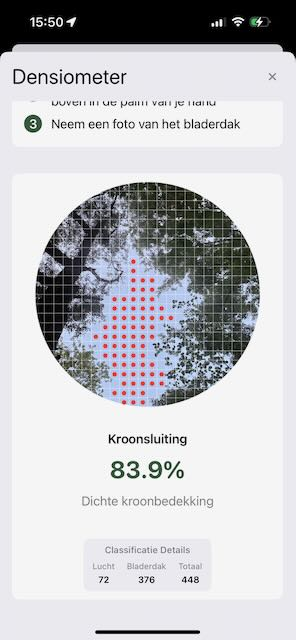

# Overzicht

Met onze digitale `densiometer` kan je snel en eenvoudig een inzicht krijgen in de kroonsluiting.

We maken hiervoor gebruik van **Apple Intelligence** dat lokaal op je iPhone aanwezig is. Het model dat we gemaakt hebben zit mee ingebakken in de applicatie. Hierdoor kunnen we bijzonder snel de kroonsluiting meten.

## Hoe werkt het eigenlijk?

Een `densiometer` heeft steeds een ronde plaat met spiegel waar je zelf moet kijken en tellen of de cel al dan niet lucht of bladeren bevat.

> Zoals je al kan inbeelden is dit redelijk foutgevoelig en vooral arbeidsintensief.

Technisch maken we nu een foto, daar nemen we een zo groot mogelijk vierkant uit en delen dit op in kleine individuele afbeeldingen.
Via artificiële intelligentie kunnen we nu die afbeeldingen laten controleren of die lucht of bladeren bevatten. Op deze manier komen we steeds tot een betrouwbaar resultaat dat reproduceerbaar is.

!!! Tip

    indien je wil zien hoe we aan het resultaat komen kan je na de meting je iPhone schudden. Daarmee krijg je een zicht op de technische luik.
    
